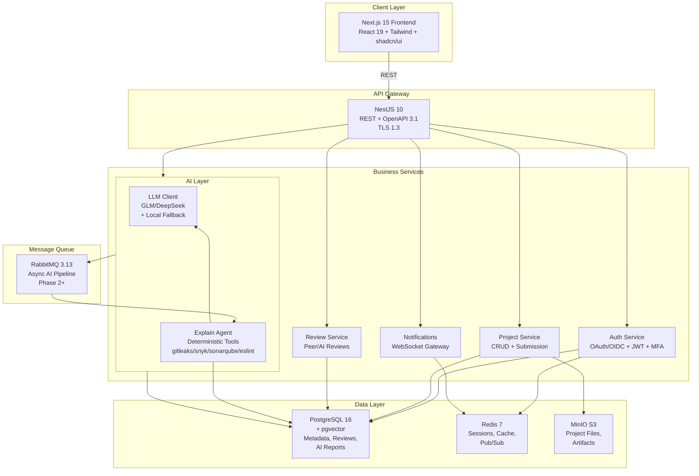

# 🏗️ TalentShowcase — Technical Architecture

> **Version:** 1.0 · **Date:** 2026-09-01 · **Status:** Phase 1 MVP

---

## 1. System Architecture Overview



---

## 2. Technology Stack

| Layer | Component | Version | Rationale |
|-------|-----------|---------|-----------|
| **Frontend** | Next.js | 15.1 | Server Components, App Router, optimal DX |
| | React | 19 | Latest stable, best performance |
| | Tailwind CSS | 3.4 | Utility-first, responsive design |
| | shadcn/ui | — | Unstyled components, full control |
| **Backend** | NestJS | 10.4 | TypeScript, DI, modular architecture |
| | Node.js | 22 LTS | Latest stable, native support |
| **API** | REST | OpenAPI 3.1 | Simplest, best tooling, OpenAPI docs |
| **Primary DB** | PostgreSQL | 16 | ACID, JSON, full-text search, pgvector |
| | TypeORM | 0.3 | ORM, migrations, type safety |
| **Cache/Session** | Redis | 7 | Fast sessions, pub/sub, cache, streams |
| **Object Storage** | MinIO | latest | S3-compatible, on-prem, versioning |
| **Message Queue** | RabbitMQ | 3.13 | Async processing, routing, Phase 2+ |
| **Secrets** | .env (dev) | — | Local development only |
| | Vault | — | Production (Phase 2) |
| **AI/LLM** | LangChain | — | LLM orchestration (Phase 2) |
| | GLM/DeepSeek | flash | Free, fast inference |
| **Observability** | OpenTelemetry | — | Traces, metrics, logs (Phase 2) |
| | Grafana/Loki | — | Visualization, log aggregation (Phase 2) |
| **CI/CD** | GitHub Actions | — | Built-in, sufficient for MVP |

---

## 3. Database Schema (PostgreSQL)

### 3.1 Core Entities

```sql
-- USER (Authentication & Profile)
CREATE TABLE "user" (
  id UUID PRIMARY KEY DEFAULT gen_random_uuid(),
  email TEXT UNIQUE NOT NULL,
  name TEXT NOT NULL,
  department TEXT,
  role TEXT NOT NULL,                          -- TALENT | REVIEWER | HR_ADMIN | DEPT_HEAD
  auth_provider TEXT,                          -- 'oauth', 'local', etc.
  password_hash TEXT,
  mfa_enabled BOOLEAN DEFAULT false,
  passkey_registered BOOLEAN DEFAULT false,
  skills JSONB DEFAULT '[]',                   -- [{name: string, level: 0-5, evidence: string}]
  career_level TEXT,                           -- 'junior', 'mid', 'senior', 'staff', 'lead'
  manager_id UUID REFERENCES "user"(id),
  created_at TIMESTAMPTZ DEFAULT now(),
  updated_at TIMESTAMPTZ DEFAULT now(),
  last_login TIMESTAMPTZ
);

-- PROJECT (Work Product Metadata)
CREATE TABLE project (
  id UUID PRIMARY KEY DEFAULT gen_random_uuid(),
  title TEXT NOT NULL,
  description TEXT,
  type TEXT NOT NULL,                          -- FULLSTACK | DATA_ANALYSIS | ML_MODEL | API | SCRIPT | DESIGN
  owner_id UUID NOT NULL REFERENCES "user"(id),
  status TEXT NOT NULL DEFAULT 'DRAFT',        -- DRAFT | SUBMITTED | UNDER_REVIEW | APPROVED | ARCHIVED
  visibility TEXT NOT NULL DEFAULT 'PRIVATE',  -- PRIVATE | TEAM | DEPT | COMPANY
  tags TEXT[] DEFAULT '{}',                    -- ["python", "xgboost", "ml"]
  tech_stack TEXT[] DEFAULT '{}',              -- ["Python", "XGBoost", "Pandas"]
  repository_url TEXT,
  demo_url TEXT,
  preview_sandbox_id UUID,                     -- Links to sandbox_session.id
  ai_summary TEXT,                             -- Cached executive summary
  ai_score NUMERIC,                            -- 0-100 overall AI confidence
  ai_report_json JSONB,                        -- Full AI report (Explain agent output)
  version INT DEFAULT 1,
  parent_project_id UUID REFERENCES project(id),
  created_at TIMESTAMPTZ DEFAULT now(),
  updated_at TIMESTAMPTZ DEFAULT now()
);

CREATE INDEX idx_project_owner_id ON project(owner_id);
CREATE INDEX idx_project_status ON project(status);
CREATE INDEX idx_project_type ON project(type);
CREATE INDEX idx_project_visibility ON project(visibility);

-- PROJECT_FILE (File Metadata)
CREATE TABLE project_file (
  id UUID PRIMARY KEY DEFAULT gen_random_uuid(),
  project_id UUID NOT NULL REFERENCES project(id) ON DELETE CASCADE,
  path TEXT NOT NULL,                          -- "src/main.py", "README.md"
  size BIGINT,                                 -- bytes
  mime_type TEXT,                              -- "application/json", "text/plain"
  s3_key TEXT NOT NULL,                        -- MinIO key for retrieval
  is_entry_point BOOLEAN DEFAULT false,        -- True if this is the "main" file
  line_count INT,
  language TEXT,                               -- "python", "typescript", "go", etc.
  created_at TIMESTAMPTZ DEFAULT now(),
  
  UNIQUE(project_id, path)
);

CREATE INDEX idx_project_file_project_id ON project_file(project_id);

-- REVIEW (Human & AI Reviews)
CREATE TABLE review (
  id UUID PRIMARY KEY DEFAULT gen_random_uuid(),
  project_id UUID NOT NULL REFERENCES project(id) ON DELETE CASCADE,
  reviewer_id UUID REFERENCES "user"(id),      -- NULL if review_type = 'AI'
  review_type TEXT NOT NULL,                   -- PEER | MENTOR | AI
  
  -- Rubric Scores (0-100 per dimension)
  scores_json JSONB NOT NULL,                  -- {
                                               --   "innovation": 85,
                                               --   "technical_depth": 92,
                                               --   "quality": 88,
                                               --   "documentation": 75,
                                               --   "business_value": 90
                                               -- }
  
  comments JSONB DEFAULT '[]',                 -- [{author_id, text, created_at, line?, file?}]
  overall_feedback TEXT,
  recommendation TEXT,                         -- PROMOTE | DEVELOP | REJECT
  
  -- Decision Gate (Human approval)
  status TEXT DEFAULT 'PENDING_APPROVAL',      -- PENDING_APPROVAL | APPROVED | REJECTED
  acted_by UUID REFERENCES "user"(id),         -- HR_ADMIN or DEPT_HEAD who approved/rejected
  acted_at TIMESTAMPTZ,
  
  created_at TIMESTAMPTZ DEFAULT now()
);

CREATE INDEX idx_review_project_id ON review(project_id);
CREATE INDEX idx_review_status ON review(status);

-- AI_REPORT (Structured AI Agent Outputs)
CREATE TABLE ai_report (
  id UUID PRIMARY KEY DEFAULT gen_random_uuid(),
  project_id UUID NOT NULL REFERENCES project(id) ON DELETE CASCADE,
  agent_type TEXT NOT NULL,                    -- EXPLAIN | CODE_ANALYST | SECURITY_SCANNER | REVIEW_EVALUATION | CAREER_ADVISOR | COMPARATIVE_ANALYSIS
  
  report_json JSONB NOT NULL,                  -- Agent-specific output format
                                               -- ExplainReport: {executiveSummary, managerSummary, peerSummary, analogies, keyHighlights, confidenceScore}
                                               -- SecurityReport: {vulnerabilities: [{severity, description, remediation}], score}
                                               -- etc.
  
  confidence_score NUMERIC,                    -- 0-100, agent's confidence in this output
  source_refs JSONB,                           -- {files: ["path/to/file.py"], lines: [10, 20], docs: ["ref1"]}
  model_version TEXT,                          -- "glm-4-flash", "deepseek-v4-flash", "local-fallback"
  
  created_at TIMESTAMPTZ DEFAULT now()
);

CREATE INDEX idx_ai_report_project_id ON ai_report(project_id);
CREATE INDEX idx_ai_report_agent_type ON ai_report(agent_type);

-- AI_INTERACTION (Full Audit Trail)
CREATE TABLE ai_interaction (
  id UUID PRIMARY KEY DEFAULT gen_random_uuid(),
  project_id UUID NOT NULL REFERENCES project(id) ON DELETE CASCADE,
  agent_type TEXT NOT NULL,
  
  prompt_hash TEXT,                            -- SHA256 hash of the prompt sent to LLM
  response_hash TEXT,                          -- SHA256 hash of LLM response
  
  tokens_used INT,                             -- Tokens consumed by LLM
  latency_ms INT,                              -- Milliseconds to generate response
  model_version TEXT,                          -- Which model was used
  
  audit_trail JSONB,                           -- {
                                               --   agent: "ExplainAgent",
                                               --   generatedAt: ISO8601,
                                               --   promptTemplate: "name",
                                               --   reportKeys: ["executiveSummary", ...]
                                               -- }
  
  created_at TIMESTAMPTZ DEFAULT now()
);

CREATE INDEX idx_ai_interaction_project_id ON ai_interaction(project_id);

-- SANDBOX_SESSION (Live Preview Sessions)
CREATE TABLE sandbox_session (
  id UUID PRIMARY KEY DEFAULT gen_random_uuid(),
  project_id UUID NOT NULL REFERENCES project(id) ON DELETE CASCADE,
  
  microvm_id TEXT,                             -- gVisor container ID or Firecracker VM ID
  status TEXT NOT NULL,                        -- SPINNING_UP | RUNNING | TERMINATED | ERROR
  
  endpoint_url TEXT,                           -- https://preview.talentshowcase.local/sandbox/session-id
  signed_url_token TEXT,                       -- Time-limited token for public access
  
  expires_at TIMESTAMPTZ NOT NULL,             -- When sandbox auto-terminates (TTL)
  
  resource_usage JSONB,                        -- {
                                               --   cpu_percent: 25.5,
                                               --   memory_mb: 256,
                                               --   disk_mb: 512,
                                               --   uptime_seconds: 1234
                                               -- }
  
  created_at TIMESTAMPTZ DEFAULT now()
);

CREATE INDEX idx_sandbox_session_project_id ON sandbox_session(project_id);
CREATE INDEX idx_sandbox_session_expires_at ON sandbox_session(expires_at);

-- SKILL_ASSESSMENT (Career Radar Data)
CREATE TABLE skill_assessment (
  id UUID PRIMARY KEY DEFAULT gen_random_uuid(),
  user_id UUID NOT NULL REFERENCES "user"(id) ON DELETE CASCADE,
  project_id UUID NOT NULL REFERENCES project(id) ON DELETE CASCADE,
  
  skills JSONB NOT NULL,                       -- {
                                               --   "backend_engineering": {
                                               --     level: 4,
                                               --     confidence: 85,
                                               --     evidence: "Built scalable APIs"
                                               --   },
                                               --   "data_engineering": {...}
                                               -- }
  
  created_at TIMESTAMPTZ DEFAULT now()
);

CREATE INDEX idx_skill_assessment_user_id ON skill_assessment(user_id);
CREATE INDEX idx_skill_assessment_project_id ON skill_assessment(project_id);
```

### 3.2 Search & Indexing

**Postgres Full-Text Search (FTS):**
```sql
-- Add tsvector column for FTS
ALTER TABLE project ADD COLUMN search_vector tsvector;

-- Trigger to keep tsvector updated
CREATE OR REPLACE FUNCTION project_search_update() RETURNS TRIGGER AS $$
BEGIN
  NEW.search_vector := 
    to_tsvector('english', NEW.title) ||
    to_tsvector('english', COALESCE(NEW.description, ''));
  RETURN NEW;
END;
$$ LANGUAGE plpgsql;

CREATE TRIGGER project_search_update_trigger
  BEFORE INSERT OR UPDATE ON project
  FOR EACH ROW EXECUTE FUNCTION project_search_update();

CREATE INDEX idx_project_search_vector ON project USING GIN(search_vector);
```

**pgvector for AI Embeddings (Phase 2):**
```sql
CREATE EXTENSION IF NOT EXISTS vector;

ALTER TABLE project ADD COLUMN ai_embedding vector(1536);  -- OpenAI embedding dimension

CREATE INDEX idx_project_ai_embedding ON project USING ivfflat(ai_embedding vector_cosine_ops)
WITH (lists = 100);
```

---

## 4. Authentication & Authorization

### 4.1 JWT Strategy

```
┌────────────┐
│   Login    │ POST /auth/login { email, password }
└─────┬──────┘
      │ Validate credentials
      ▼
┌────────────────────────┐
│ Generate JWT Tokens    │
│ - access: 15 min       │
│ - refresh: 7 days      │
└─────┬──────────────────┘
      │
      ▼
┌────────────────────────┐
│ Store in Redis Session │
│ user:token:xxx         │
│ TTL: 7 days            │
└─────┬──────────────────┘
      │
      ▼
┌─────────────────────────┐
│ Return to Frontend      │
│ { accessToken, user }   │
└─────────────────────────┘
```

**JWT Payload:**
```json
{
  "sub": "uuid-of-user",
  "email": "alice@company.com",
  "role": "TALENT",
  "iat": 1234567890,
  "exp": 1234568490
}
```

### 4.2 RBAC (Role-Based Access Control)

Four roles with hierarchical permissions:

| Role | Can View | Can Modify | Can Approve |
|---|---|---|---|
| **TALENT** | Own projects, published projects | Own projects | — |
| **REVIEWER** | Published projects | Leave reviews | — |
| **HR_ADMIN** | All projects, reviews | Approve/reject reviews | ✅ |
| **DEPT_HEAD** | Dept projects, reviews | Leave reviews | ✅ (dept-scoped) |

Enforced via `@UseGuards(JwtAuthGuard, RolesGuard)` and `@Roles('HR_ADMIN')` decorators.

---

## 5. AI Agent Architecture (Phase 1: Explain Agent)

### 5.1 Explain Agent Flow

```
Project Submitted
      │
      ▼
┌──────────────────────┐
│ Extract Context      │
│ - Title, type        │
│ - Description        │
│ - Tech stack         │
│ - File summary       │
└──────────┬───────────┘
           │
           ▼
┌──────────────────────┐
│ Build LLM Prompt     │
│ System: "You are..." │
│ User: "Explain..."   │
└──────────┬───────────┘
           │
           ▼
┌──────────────────────┐
│ Call LLM             │
│ GLM/DeepSeek/Local   │
└──────────┬───────────┘
           │
           ▼
┌──────────────────────┐
│ Parse Response       │
│ Validate JSON schema │
│ Or fallback          │
└──────────┬───────────┘
           │
           ▼
┌──────────────────────┐
│ Persist Report       │
│ AI_REPORT table      │
│ AI_INTERACTION audit │
└──────────┬───────────┘
           │
           ▼
┌──────────────────────┐
│ Update Project       │
│ ai_summary, ai_score │
└──────────────────────┘
```

### 5.2 Deterministic Tools (Phase 2+)

Instead of asking LLM to compute metrics, we use dedicated tools:

- **AST Parsing:** `@typescript-eslint/parser` for TS, `python-ast` for Python
- **Complexity:** `eslint-plugin-complexity`, `radon` (Python)
- **Security:** `gitleaks`, `snyk`, `sonarqube`, `trivy`
- **Dependencies:** `npm audit`, `pip-audit`, `cargo audit`

**Pattern:** Deterministic → LLM narrative
```
Tool: "gitleaks scan found API key in config.py:42"
LLM: "Translates to → Consider using environment variables for secrets"
```

---

## 6. API Contract (OpenAPI 3.1)

### 6.1 Auth Endpoints

**POST /auth/login**
```json
Request:
{
  "email": "alice@company.com",
  "password": "password123"
}

Response 200:
{
  "accessToken": "eyJhbGc...",
  "refreshToken": "eyJhbGc...",
  "user": {
    "id": "uuid",
    "email": "alice@company.com",
    "name": "Alice Smith",
    "role": "TALENT",
    "department": "Engineering"
  }
}
```

### 6.2 Project Endpoints

**POST /projects** (create draft)
```json
Request:
{
  "title": "Customer Churn Predictor",
  "type": "ML_MODEL",
  "visibility": "DEPT",
  "description": "...",
  "tags": ["python", "xgboost"],
  "techStack": ["Python", "XGBoost", "Pandas"]
}

Response 201:
{
  "id": "proj-uuid",
  "title": "Customer Churn Predictor",
  "status": "DRAFT",
  "ownerId": "user-uuid",
  ...
}
```

**GET /projects** (browse with pagination)
```
Query params:
  ?search=churn&type=ML_MODEL&status=SUBMITTED&page=1&pageSize=20&sortBy=createdAt&sortOrder=desc

Response 200:
{
  "items": [ {...}, {...} ],
  "total": 42,
  "page": 1,
  "pageSize": 20,
  "totalPages": 3
}
```

**POST /projects/:id/submit** (submit for review)
```
Response 202 Accepted:
{
  "id": "proj-uuid",
  "status": "SUBMITTED",
  "updatedAt": "2026-09-01T10:30:00Z"
}
```

### 6.3 AI Endpoints

**POST /projects/:id/ai/explain** (generate report)
```
Response 202 Accepted:
{
  "queued": true,
  "reportId": "report-uuid"
}

Note: Phase 1 runs synchronously; Phase 2 moves to async via RabbitMQ
```

**GET /projects/:id/ai/report** (fetch report)
```
Response 200:
{
  "id": "report-uuid",
  "projectId": "proj-uuid",
  "agentType": "EXPLAIN",
  "reportJson": {
    "executiveSummary": "...",
    "managerSummary": "...",
    "peerSummary": "...",
    "analogies": ["..."],
    "keyHighlights": ["..."],
    "confidenceScore": 88
  },
  "confidenceScore": 88,
  "modelVersion": "glm-4-flash",
  "createdAt": "2026-09-01T10:30:00Z"
}
```

---

## 7. Security Deep Dive

### 7.1 Input Validation (Zod)

All request bodies validated via Zod schemas in `packages/types/src/`:

```typescript
export const CreateProjectSchema = z.object({
  title: z.string().min(1).max(200),
  description: z.string().max(5000).optional(),
  type: z.nativeEnum(ProjectType),
  visibility: z.nativeEnum(ProjectVisibility).default('PRIVATE'),
  tags: z.array(z.string().max(50)).max(20).default([]),
  techStack: z.array(z.string().max(50)).max(20).default([]),
});
```

Used in controller:
```typescript
@Post()
async create(@Body() body: CreateProjectInput): Promise<Project> {
  const parsed = CreateProjectSchema.parse(body); // Throws if invalid
  return this.projectsService.create(req.user.sub, parsed);
}
```

### 7.2 Parameterized Queries (TypeORM)

Never construct SQL strings. Always use QueryBuilder:
```typescript
// ✅ GOOD
qb.where('project.title ILIKE :search', { search: `%${query.search}%` })

// ❌ BAD
qb.where(`project.title ILIKE '%${query.search}%'`)
```

### 7.3 PII Redaction (AI Safety)

Before sending to LLM, redact sensitive fields:
```typescript
async generateExplainReport(projectId: string) {
  const project = await this.projectsService.findById(projectId);
  
  // Redact owner email before sending to LLM
  const context: ExplainContext = {
    title: project.title,
    description: project.description,
    type: project.type,
    techStack: project.techStack,
    tags: project.tags,
    // fileSummary is safe (no PII)
    fileSummary: files.map(f => `${f.path} (${f.language}, ${f.lineCount} lines)`).join(',')
  };
  
  return this.explainAgent.generate(context);
}
```

### 7.4 Audit Logging

Every LLM call logged with hashed prompt/response:
```typescript
private async logInteraction(
  projectId: string,
  agentType: AgentType,
  report: ExplainReport,
): Promise<void> {
  const promptHash = createHash('sha256').update(agentType + projectId).digest('hex');
  const responseHash = createHash('sha256').update(JSON.stringify(report)).digest('hex');

  await this.interactionRepo.save(
    this.interactionRepo.create({
      projectId,
      agentType,
      promptHash,
      responseHash,
      modelVersion: 'glm-4-flash',
      auditTrail: {
        agent: 'ExplainAgent',
        generatedAt: new Date().toISOString(),
        reportKeys: Object.keys(report),
      },
    }),
  );
}
```

---

## 8. Deployment & Scaling (On-Prem)

### 8.1 Development (Docker Compose)
```yaml
postgres:    port 5432 (PG + pgvector)
redis:       port 6379 (cache, sessions)
minio:       port 9000/9001 (S3-compatible storage)
rabbitmq:    port 5672/15672 (message queue)
```

All data persists in named volumes (`postgres_data`, `redis_data`, etc.).

### 8.2 Production (Single VM or Bare Metal)

**Services:**
- **API:** NestJS compiled to Node
- **Web:** Next.js compiled to static + server
- **PostgreSQL:** Managed or self-hosted with replication
- **Redis:** Single instance or Sentinel for HA
- **MinIO:** Multi-disk setup with versioning
- **RabbitMQ:** Single node or cluster (Phase 2)

**Reverse Proxy:** Nginx or HAProxy
```
Client → Nginx (port 443, TLS) → API (port 4000) + Web (port 3000)
```

**Monitoring:** (Phase 2+)
- Prometheus scrapes metrics from `/metrics`
- Grafana dashboards
- Loki logs aggregation

---

## 9. Performance & Scaling

### 9.1 Database Optimization

**Queries:**
- All list endpoints use pagination (limit 100)
- Indexes on `project(status, type, owner_id)`
- FTS index on `project.search_vector` for keyword search
- pgvector IVFFlat index for AI embedding similarity (Phase 2)

**Connection Pool:**
```typescript
// apps/api/src/app.module.ts
typeorm: {
  host: process.env.DB_HOST,
  pool: {
    max: 10,
    min: 2,
    connectionTimeoutMillis: 5000,
    idleTimeoutMillis: 30000,
  }
}
```

### 9.2 Caching Strategy

**Redis cache layers:**
- Session: `user:jwt:${hash}` (TTL: 7 days)
- Project detail: `project:${id}` (TTL: 5 min, invalidate on update)
- Discovery list: `projects:discover:${query_hash}` (TTL: 1 min)

**Cache invalidation:**
```typescript
async update(id: string, input: UpdateProjectInput) {
  const project = await this.projectRepo.save({...});
  await this.redis.del(`project:${id}`);
  await this.redis.del(`projects:discover:*`); // Simple pattern (Phase 2: use Lua script)
  return project;
}
```

### 9.3 Load Testing (Phase 2+)

```bash
# k6 load test: 1000 concurrent users
k6 run --vus 1000 --duration 10m tests/load-test.js

# Expected: <200ms p95 latency, <5% error rate
```

---

## 10. Disaster Recovery & Backup

### 10.1 PostgreSQL
```bash
# Daily full backup
pg_dump talentshowcase > backup-$(date +%Y%m%d).sql

# Point-in-time recovery
# WAL archival enabled (pg_wal_level = replica)
```

### 10.2 MinIO
```bash
# Versioning enabled
# Cross-region replication (cloud deployments)
# Regular backups via mc mirror
```

### 10.3 Redis
```bash
# RDB snapshots every 1 min
# AOF (append-only file) for durability
# Replication (Phase 2)
```

---

## 11. Future Enhancements (Phase 2+)

- **Async AI Pipeline:** Move Explain Agent to RabbitMQ workers
- **Additional Agents:** Code Analyst, Security Scanner, Review & Eval, Career Advisor
- **Sandbox Execution:** gVisor for live previews, Firecracker for better isolation
- **File Upload:** tus.io resumable uploads, virus scanning (ClamAV)
- **Real-Time Collab:** WebSocket-based inline comments, cursor presence
- **Advanced Search:** Elasticsearch + pgvector semantic search
- **Multi-Region:** Kubernetes + cross-region replication
- **SSO/SAML:** Enterprise IdP integration

---

**See Also:** [PRD.md](./PRD.md) · [README.md](./README.md)